# gRPC: Under The Hood

Как обычно воспринимается gRPC? Как "черная коробка", которая как-то через protobuf позволяет вызывать код в другом сервисе. Популярная коробка, про использование которой уже вышло очень много материалов. А как она работает? Что там происходит на уровне сети и отдельных байтов? Давайте разбираться на практике, реализовав самописный gRPC сервер, который успешно пройдет тесты со стандартным Go gRPC клиентом. 

Если хочется меньше воды (история, обзор HTTP/2), то можно пропустить "Предысторию" и перейти сразу к [кишочкам](#структура-http2). Но в любом случае запасаемся вкусняшками, дорога будет долгой.

## Предыстория
Начать стоит с того, для каких целей вообще был создан gRPC? Это позволит лучше понять его сильные стороны и как они реализованы. Без чего gRPC не был бы собой, а что является не обязательным.
А появился gRPC не с чистого листа, а как open source развитие внутреннего RPC фреймворка в Google под названием Stubby. Публично про него известно не так много: появился в 2001 году, а [в 2016](https://cloud.google.com/blog/products/gcp/grpc-a-true-internet-scale-rpc-framework-is-now-1-and-ready-for-production-deployments) речь шла о десятках миллиардов RPS, обработанных с его помощью. Выглядит как довольно зрелое и оттестированное решение.

Как же Stubby был устроен? Встречаются два варианта:
1. JSON по TCP (или HTTP/1). Этот вариант упоминается, например, [тут](https://readmedium.com/unleashing-the-power-of-grpc-18a07f12b8bd). Вариант звучит интересно, но есть нюанс. JSON как формат тогда еще не существовал: [по словам создателя JSON](https://youtu.be/-C-JoyNuQJs?si=0xiKgryjVznXOZih&t=124), Дугласа Крокфорда, в апреле того же самого 2001 года JSON еще только-только зарождался, а стабильный RFC появился годы спустя.

И кажется очень сомнительным, что Google для важнейшего протокола могли выбрать никому еще не известный формат от автора, который работал не у них.
2. Другим вариантом принципа работы Stubby является связка protobuf и HTTP/1. Первая версия protobuf [появилась в начале того же 2001 года](https://protobuf.dev/history/) внутри самого Google, и вполне могла использоваться и развиваться вместе с gRPC. Этот же вариант в 2011 году [подтвердил Бред Фицпатрик](https://groups.google.com/g/golang-nuts/c/34ITEzwxmE4/m/fAhG9bA72poJ) в качестве ответа на очень интересный вопрос: "А можете выложить Stubby в open source?". 
И действительно, в 2001 году фреймворк появился, и за 10 лет уже должен был быть достаточно зрелым, чтобы поделиться им с сообществом. Или нет? На вопрос о публикации Stubby [Расс Кокс предложил](https://groups.google.com/g/golang-nuts/c/34ITEzwxmE4/m/gNEfNOc3eJYJ) взять гошный rpc пакет (который, на минуточку, поверх [gob](https://go.dev/blog/gob), появившемся в Go на замену protobuf). И получается, что Stubby - это не то, что стоит открывать сообществу.

Однако, спустя 4 года в 2015 неожиданно появляется gRPC. Почему?
- В 2001 появляется protobuf, а с его помощью создается Stubby (protobuf + HTTP/1);
- В 2011 появляется альтернативный Go rpc/gob (*Кто им пользовался в проде? Напишите в комментариях*);
- В 2010 появляется [SPDY](https://en.wikipedia.org/wiki/SPDY), новая версия HTTP протокола;
- В 2012 появляется [QUIC](https://en.wikipedia.org/wiki/QUIC), еще более новая версия HTTP на основе UDP;
- В 2014 SPDY стабилизируется и превращается в HTTP/2;
- В 2015 году появляется gRPC. Совпадение?

Не совпадение. Про это так и написано в [мотивации к возникновению gRPC](https://grpc.io/blog/principles/): появление новых публичных протоколов, которые предоставляю фичи, не доступные Stubby. В случае с gRPC был выбран HTTP/2, как уже стабильный к тому моменту.
Чем же HTTP/2 настолько лучше HTTP/1, что Google решили заменить Stubby на gRPC и сделать реализацию доступной всем?

## Проблема HTTP/1
Как вообще высокоуровнево устроен в HTTP/1? Протокол ориентирован на взаимодействие в формате запрос_клиента => ответ_сервера. Установили TCP соединение, отправили запрос, подождали ответ, вычитали ответ. Если хочется отправить второй запрос, то обычно его отсылают после вычитывания ответа на первый. Еще можно значительно сэкономить время и использовать [HTTP/1.1 pipelining](https://en.wikipedia.org/wiki/HTTP_pipelining), когда следующий запрос отсылается до получения ответа на предыдущие. Но ответы все-равно приходят в порядке отправки запросов на сервер.
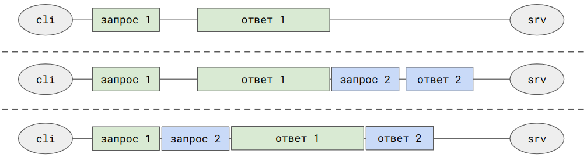
Чтобы был шанс получить ответ на более легкий запрос быстрее, чем на предыдущий тяжелый, единственный вариант в HTTP/1 - установить несколько соединений с сервером, но число таких соединений весьма ограничено.
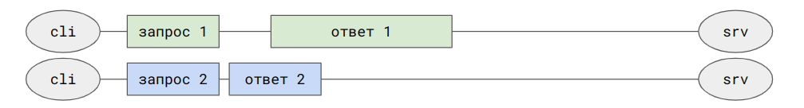

А что произойдет, если один из TCP фрагментов ответов сервера потерялся и не дошел до клиента (так называемый [TCP Head-of-line Blocking](https://readmedium.com/head-of-line-hol-blocking-in-http-1-and-http-2-50b24e9e3372))? Он, как и все последующие фрагменты, даже успешно дошедшие, с точки зрения TCP будут не доступны для клиента. Потеряли пакет первого ответа, а второй ответ пришел полностью? Увы, ждите, "у нас обед". Клиент должен будет выждать таймаут ожидания фрагмента, отправить на сервер запрос на переотправку, дождаться успешного получения. И только после этого и первый и, давно уже полученный, второй ответы будут возвращены клиенту.  
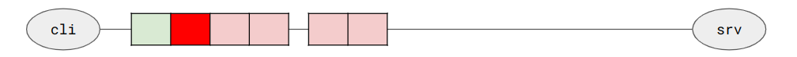

## Соединение
Чтобы понять, что и как улучшено в HTTP/2, давайте начнем уже писать наш gRPC сервер. Начнем долгую дорогу с самого начала - с установления соединения.
```go
l, _ := net.Listen("tcp", addr)

for {
    conn, _ := l.Accept()

    go func() {
        serveConn(conn)
        _ = conn.Close()
    }()
}
```
Теперь у нас есть TCP сервер, принимающий соединения. Осталось дорисовать сову, но как? Читать документацию? Пфффф! Давайте лучше отреверсим протокол. Опишем простой proto сервис и попробуем на нем реализовать все, что нам нужно:
```protobuf
service GrpcTestService {
  rpc Ping(PingRequest) returns (PingResponse);
}

message PingRequest {
  int32 val = 1;
}

message PingResponse {
  int32 val = 1;
}
```

Как клиенту подключиться к нашему серверу? Можно, конечно, сразу взять стандартный Go gRPC клиент:
```go
conn, _ := grpc.Dial(l.Addr().String())
defer conn.Close()

client := grpcTestPb.NewGrpcTestServiceClient(conn)
resp, _ := client.Ping(ctx, &grpcTestPb.PingRequest{Val: 42})
```
Но далеко мы так, увы, не уедем. Стоит начать реализацию итеративно.

Подключиться можно попробовать и простым curl с указанием на HTTP/2: ```curl --http2 'http://127.0.0.1:8085/some/path'```
В этом случае клиент отправит вроде бы обычный HTTP/1.1 запрос:
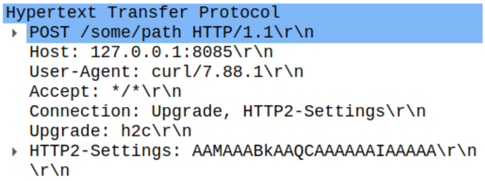
Единственное не самое ожидаемое - это заголовки Connection и Upgrade.

Это [предложение на смену протокола](https://developer.mozilla.org/en-US/docs/Web/HTTP/Headers/Upgrade), когда клиент сообщает серверу, что хотел бы поменять протокол. Обмен пакетами выглядит так:
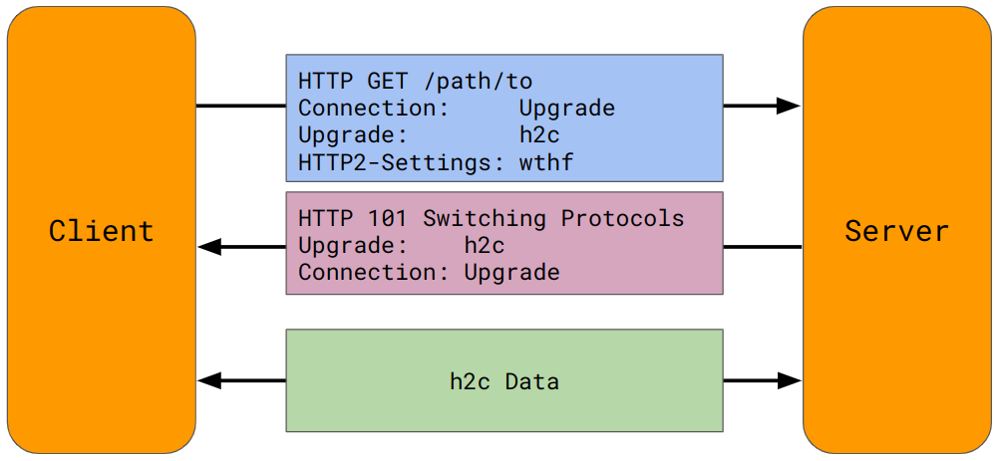
Клиент шлет серверу `Connection: Upgrade` и `Upgrade: название-нового-протокола`, а сервер, если поддерживает, возвращает в ответ статус `101 Switching Protocols` и те же самые заголовки. После этого, обе стороны считают, что протокол поменялся.

Где мы могли видеть что-то похожее? При использовании WebSocket. За тем лишь исключением, что при отсутствии поддержки со стороны сервера, дальнейший обмен не возможен.
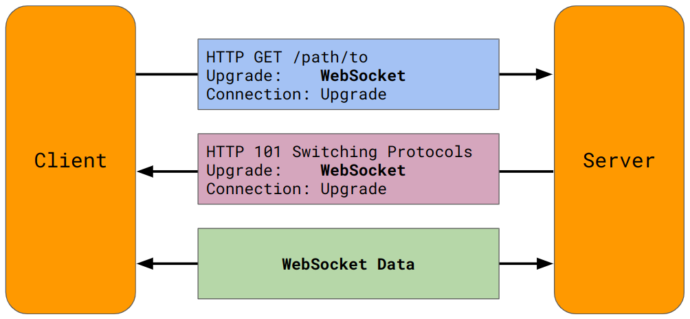

Название протокола для HTTP/2 (`h2c`) выглядит интуитивно понятным, но все же стоит посмотреть в стандарт на всякий случай :) И не зря, [там](https://datatracker.ietf.org/doc/html/rfc9113#name-http-2-version-identificati) есть два варианта:
```
The protocol defined in this document has two identifiers.

The string "h2" identifies the protocol where HTTP/2 uses Transport Layer Security (TLS).

The "h2c" string was previously used as a token for use in the HTTP Upgrade mechanism's Upgrade header field.
```
Основной вариант работы HTTP/2 - поверх HTTPS TLS, и тогда используется `h2`. Для иных случаев есть deprecated идентификатор `h2c`, который у нас и получился. Забегая вперед, он используется как curl, так и Go gRPC клиентом. Так что сейчас нам хватит знания только о нем, а `h2` и [ALPN](https://readmedium.com/geekculture/exploring-application-layer-protocol-negotiation-alpn-c47b5ec3b419) останутся за рамками. Единственный важный тут момент в том, что `h2` не подразумевает стадии обновления протокола, и клиент заранее знает, что другая сторона точно умеет в HTTP/2 ([prior-knowledge](https://datatracker.ietf.org/doc/html/rfc9113#name-starting-http-2-with-prior-)). В этом случае обмен Upgrade+SwitchProtocols пакетами не нужен, и стороны могут сразу переходить к общению по HTTP/2:
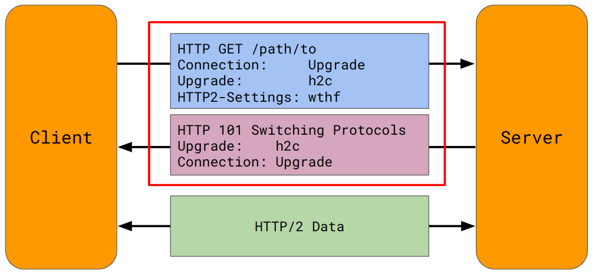

curl умеет в этот режим при указании одноименного параметра: ```curl --http2-prior-knowledge 'http://127.0.0.1:8085/some/path'```.

## Магия
Но при любом варианте, с обновлением протокола или prior-knowledge, первым пакетом, который клиент шлет серверу уже в рамках HTTP/2 соединения, будет magic:
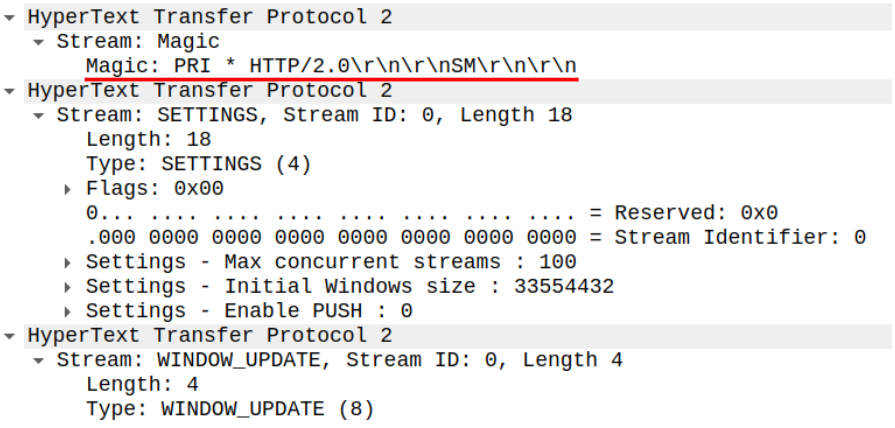
По сути, клиент шлет криво сформированный HTTP запрос?
```http request
PRI * HTTP/2.0
 
SM
```
Что это? Зачем?

Если обратиться к RFC (да-да, уже второй раз приходится читать tfm, сколько можно?), то можно узнать две вещи:
1. Этот псевдо запрос используется для защиты от реализаций, которые не умеют в HTTP/2, но еще не отвалились на предыдущем шаге обновления протокола. И он оставлен так, чтобы все известные на тот момент реализации серверов точно не могли его корректно обработать (ToDo: ссылка).
2. Такой запрос появился не сразу, а между маем и июлем 2013 года. Почему?
```
Май  2013: FOO * HTTP/2.0\r\n\r\nBA\r\n\r\n
Июль 2013: PRI * HTTP/2.0\r\n\r\nSM\r\n\r\n 
```

В это время случился слив информации о программе АНБ США Prism [Эдвардом Сноуденом](https://en.wikipedia.org/wiki/Edward_Snowden).

И авторы HTTP/2 увековечили этот поступок в протоколе (ToDo: ссылка). Так что при каждой установке HTTP/2 и gRPC соединения мы передаем привет АНБ.

А итоговая схема хендшейка по HTTP/2 выходит такой:
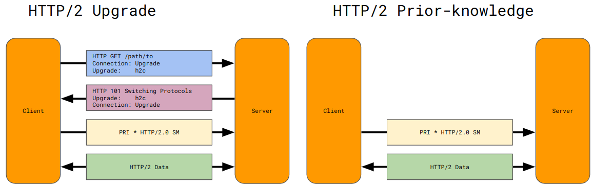
И пора уже переходить к кишочкам HTTP/2 Data!

## Структура HTTP/2
Чем тут может помочь HTTP/2? Новая версия протокола реализует мультиплексирование, или перемешивание фрагментов запросов и ответов. В случае, если ответ на второй запрос становится готовым к отправке, когда весь ответ на первый запрос еще не ушел, то сервер может начать слать фрагменты ответов по очереди (при равном приоритете, но это уже за рамками, мы же сейчас просто gRPC хотим).
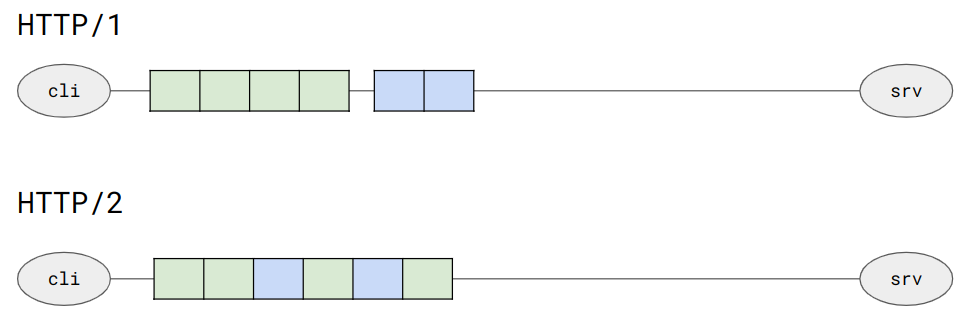
И, если теперь произойдет потеря TCP фрагмента, но ответ на второй ответ уже полностью пришел, то клиент сможет получить этот ответ, несмотря на то, что с точки зрения порядка отправки запросов должно быть наоборот. Это полезная возможность на сети с небольшой потерей пакетов, но починить HoL blocking полностью способен только HTTP/3. 
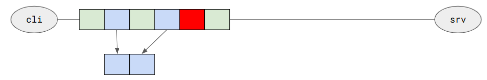
Этот же механизм мультиплексирования позволяет прервать выполнение запроса по дедлайну/таймауту, и сервер перестанет слать оставшиеся куски ответов.

Как это работает? HTTP/2 не просто шлет данные по соединению, разбивая на блоки, но оборачивает их в свой формат фреймов:
```go
Frame struct {
    PayloadLength uint32
    Type          FrameType
    Flags         FrameFlags  
    StreamId      uint32

    Payload       []byte
}

FrameType uint8

FrameFlags uint8
```

### Frame.StreamId
Номер стрима нужен в каждом фрейме как раз из-за механизма мультиплексирования. Он позволяет второй стороне понять, к какому запросу/ответу относится каждый конкретный фрейм.
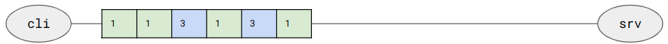
Первый запрос и ответ на него содержат streamId равный 1, второй запрос и ответ - стрим с номером 3. Почему 3, а не 2? По договоренности (ToDo: ссылка) стримы, инициализируемые клиентом, должны иметь нечетные номера, а стримы со стороны сервера ([HTTP/2 Server Push](https://en.wikipedia.org/wiki/HTTP/2_Server_Push)) - четные.
Получается, что логический стрим в HTTP/2 - это аналог комбинации запрос+ответ в HTTP/1.

### Frame.Flags
А для того, чтобы понять, что второй фрейм ответа на второй запрос - последний, и собранный ответ можно отдавать клиентской логике, в фреймах используется флаг `FlagEndStream`. Еще одним примером флагов может служить `FlagEndHeaders`, который используется при заголовках, не влезающих в один фрейм, но до этого мы еще и так дойдем вскоре. 

### Frame.Type
HTTP/2 определяет и использует несколько типов передаваемых фреймов. Вот не все, но большая часть из них, без которых реализация gRPC сервера не могла работать:
```go
FrameHdr struct {
    PayloadLength uint32
    Type          FrameType
    Flags         FrameFlags
    StreamId      uint32
}

DataFrame struct { // payload (тело) запроса и ответа
   FrameHdr
   Data []byte
}

HeadersFrame struct { // заголовки запроса и ответа
   FrameHdr
   Exclusive           bool
   StreamIdDepend      uint32
   Weight              uint8
   HeaderBlockFragment []hpack.HeaderField
}

SettingsFrame struct { // настойки соединения
    FrameHdr
    Params []SettingsFrameParam
}

PingFrame struct { // ping&pong
    FrameHdr
    Data uint64
}

GoawayFrame struct { // graceful shutdown со стороны сервера
    FrameHdr
    LastStreamId uint32
    ErrorCode    ErrorCode
    DebugData    []byte
}

WindowUpdateFrame struct { // flow контроль
    FrameHdr
    WindowSizeIncrement uint32
}
```

Полный список с подробными описаниями есть в [документации](https://datatracker.ietf.org/doc/html/rfc7540#section-6), но сейчас нам интересны только первые два типа: DATA и HEADERS фреймы.

### DataFrame и HeadersFrame

Как в HTTP/1 выглядят запрос и ответ?
```http request
POST /path HTTP/1
Header1: value1
Header2: value2

body1


200 OK
Header3: value3
Header4: value4

body2
```
Request line, заголовки запроса, опциональное тело, и, соответственно, response line, заголовки ответа, опциональное тело.

А как это выглядит в HTTP/2? Есть только заголовки и тело.
```go
// запрос
[]HeadersFrame
[]DataFrame

// ответ
[]HeadersFrame
[]DataFrame
```
Для того чтобы представить request и response строки в формате HTTP/2, они в стандарте заменяются на [псевдо-заголовки](datatracker.ietf.org/doc/html/rfc9113#section-8.3-1):
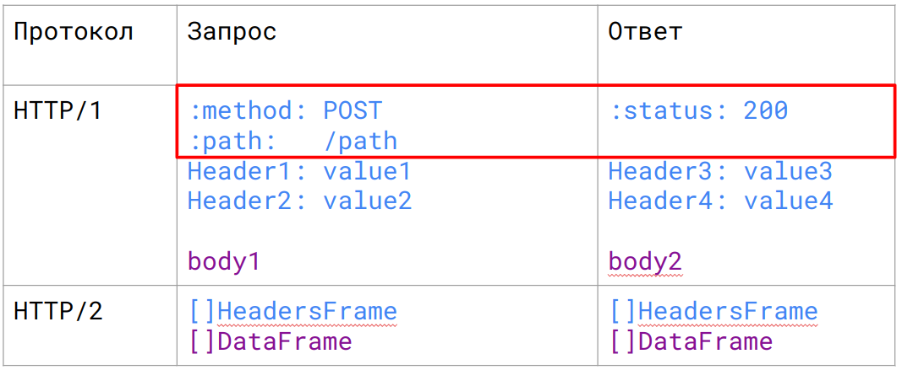
Имена заголовков, начинающиеся с `:` специально отведены под передачу таких нетипичных значений.

И в таком виде текстовый HTTP/1 прекрасно матчится на бинарный HTTP/2:
```go
POST /path HTTP/1
Content-Length: 12

{"hello":42}
```
превращается в
```go
HeadersFrame {
    StreamId: 1
    Flags:    FlagEndHeaders
    [   :method:        POST
        :path:          /path
        Content-Length: 12
    ]
}
DataFrame {
    StreamId:      1
    Flags:         FlagEndStream
    PayloadLength: 12
    Data:          {"hello":42}
}
```
Вначале передается фрейм заголовков с флагом `FlagEndHeaders`, т.е. все заголовки вместились в один фрейм. Затем идет единственный фрейм с телом запроса и флагом `FlagEndStream`, обозначающим конец запроса.

Как должен ответить наш HTTP/2 сервер, чтобы клиент его понял?
Если мы хотим прислать в ответ
```go
200 OK
Content-Length: 0
Date: Wed, 07 Feb 2024 12:34:56 GMT
```
то сервер может отправить единственный фрейм заголовков с флагами и конца заголовков и конца ответа (тела же нет):
```go
HeadersFrame {
    StreamId: 1
    Flags:    FlagEndHeaders |
              FlagEndStream
    [  :status:        200
       Content-Length: 0
       Date:           Wed, 07 Feb 2024 12:34:56 GMT
    ]
}
```
По сути, с минимальной реализацией HTTP/2 мы в целом разобрались. Уже в таком виде наш сервер будет корректно обрабатывать запросы клиентов. Или не будет?

### HPACK
В случае передачи одинаковых заголовков (User-Agent, Cookie, Authorization, Content-Type, ...) в HTTP/1 мы вынуждены передавать их каждый запрос и ответ заново, тратя на это и трафик и вычислительные ресурсы. Этот недостаток HTTP/2 решает введением [сжатия заголовков](httpwg.org/specs/rfc7541.html) при помощи двух словарей: статического, [заданного стандартом](https://httpwg.org/specs/rfc7541.html#rfc.section.A), и динамического, который стороны формируют по мере существования одного конкретного коннекта.

Если в запросе или ответе встречается заголовок, который указан в одной из таблиц, то вместо него передается только индекс из таблицы. Например, вместо передачи `:method: POST` можно передать только байт `3` и обе стороны поймут, о чем речь. А вместо `:path: /path` нужно передать байт `4` и нестандартное значение заголовка `/path`. А в ответе статус `:status: 200` заменяется на единственный байт `8`.
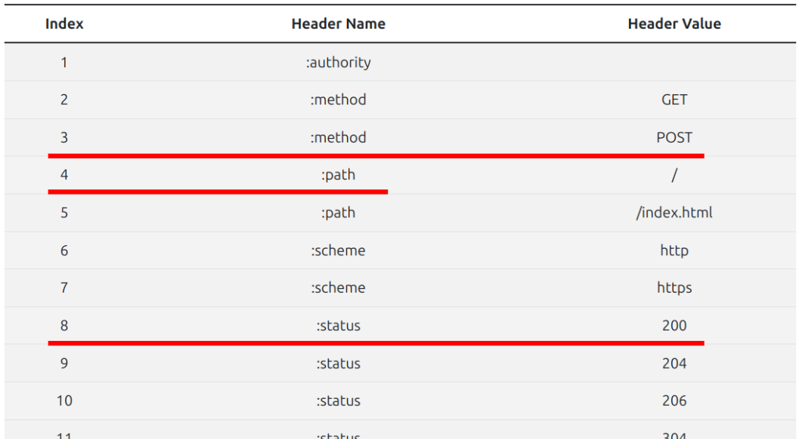
К примеру `POST / HTTP/1.1\r\n` (17 байт) превращается в 2 байта `3+4`. Удобно.

Для новых заголовков, которых нет в статическом словаре, заводится динамический словарь. И вот тут отлично себя чувствуют длинные заголовки, вроде JWT токенов или кук, которые так же ужимаются в 1-2 байта индекса динамического словаря. Для этого требуется лишь единожды передать полное значение (в дополнение пожатое Huffman'ом) с соответствующим индексом, и вторая сторона это запомнит. Словарь живет до разрыва соединения и имеет размер, о котором стороны договорились через settings фреймы.
Для gRPC это сжатие нам тоже очень пригодится.

### Тесты
Для проверки работоспособности реализации была написана пачка тестов (по сути TDD подход), которые в общем случае выглядят так:
```go
func Test_H2C_HTTP2PriorKnowledge(t *testing.T) {
   l, _ := net.Listen("tcp", ":0")
   defer l.Close()

   ctx, cancel := context.WithCancel(context.TODO())
   defer cancel()

   h2s := NewServer()

   h2s.Listen(l)
   go h2s.Serve(ctx)
   // ...
}
```
Тест начинает слушать порт и на нем стартует реализацию сервера. Обработчик HTTP запросов формирует запрос, который потом может быть проверен в тесте.  

```go
func httpHandler(req *Request, resp *Response) error {
   response.Headers = map[string]string{
      "content-type": "text/plain; charset=utf-8",
   }

   response.Body = []byte(
       fmt.Sprintf("Hello, %v", request.URI),
   )

   response.Status = 200

   return nil
}
```
И остается в тесте обычным Go HTTP клиентом сделать запрос и проверить ответ. Так как реализация сервера не умеет в HTTP/1, то успешно пройденный тест подтверждает, что у нас получилось :)
```go
func Test_H2C_HTTP2PriorKnowledge(t *testing.T) {
   l, _ := net.Listen("tcp", ":0")
   defer l.Close()

   ctx, cancel := context.WithCancel(context.TODO())
   defer cancel()

   h2s := NewServer()
   h2s.SetHTTPHandler(httpHandler) // Задание обработчика
   h2s.Listen(l)
   go h2s.Serve(ctx)

    var client http.Client
    
    uriPath := fmt.Sprintf("/hello?world=%d", rand.Int())
    uri := "http://" + l.Addr().String() + uriPath
    
    resp, _ := client.Get(uri)
    
    b, _ := io.ReadAll(resp.Body)
    
	// Проверка, что сервер возвращает то, что было указано в коде обработчика
    require.Equal(t, 200, resp.StatusCode)
    require.Equal(t, `Hello, `+uriPath, string(b))
}
```
В итоговой реализации кроме этого теста на GET запрос, [есть так же тесты](https://github.com/atercattus/tinygrpc/blob/main/conn_test.go) на POST с небольшим и огромным телом, HTTPS соединение с сертификатом, запросы из множества горутин для теста мультиплексирования и отсутствия data race. Что дает нам минимальную реализацию для того, чтобы перейти к самому интересному - gRPC.

## gRPC
Наконец-то мы дошли до момента, когда можно вернуться к варианту подключения к серверу с помощью стандартного gRPC клиента:
```go
conn, _ := grpc.Dial(l.Addr().String())
defer conn.Close()

client := grpcTestPb.NewGrpcTestServiceClient(conn)
resp, _ := client.Ping(ctx, &grpcTestPb.PingRequest{Val: 42})
```

Если этот gRPC Unary call отправить в HTTP обработчик, то получим два фрейма с содержимым:
```
:method:        POST
:path:          /grpctest.v1.GrpcTestService/Ping
content-type:   application/grpc
te:             trailers
user-agent:     grpc-go/1.52.0

[0 0 0 0 2 8 42] // []byte для удобства восприятия, в реальности тут просто 7 байт
```
По сути мы получили HTTP POST запрос, где в `:path` содержится склейка имени пакета, сервиса и его метода. Т.е. можно понять, что именно за метод был вызван.
```protobuf
// :path: /grpctest.v1 . GrpcTestService / Ping

package grpctest.v1;

service GrpcTestService {
    rpc Ping(PingRequest) returns (PingResponse);
}
```

Еще и `content-type: application/grpc` дает понимание, что у нас gRPC вызов, а не просто HTTP. Выглядит так, что запрос уже можно обработать. Главное понять, что у нас в теле запроса? Протобаф?
 Если попробовать анмаршалить тело `[0 0 0 0 2 8 42]`, то ничего не выйдет. И в третий раз придется обратиться к [документации](github.com/grpc/grpc/blob/master/doc/PROTOCOL-HTTP2.md), где говорится, что на самом деле в теле приходит небольшая обертка над protobuf сообщением:
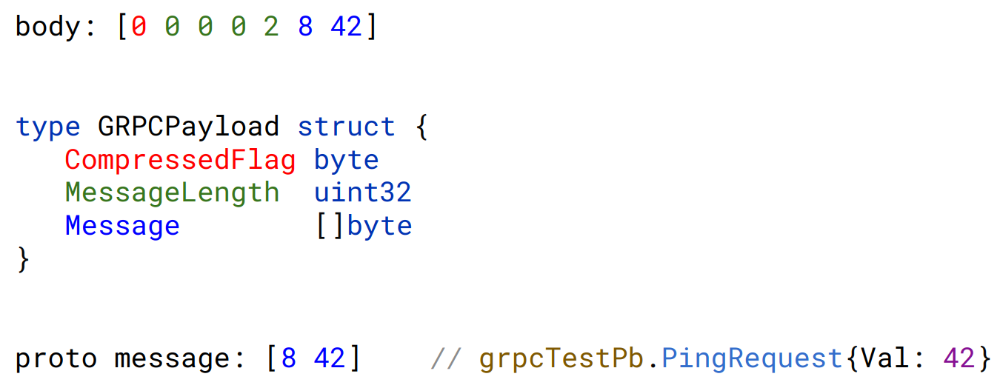
Вот теперь мы научились принимать gRPC Unary call. Осталось научиться на него отвечать.

Для тестирования пусть наш обработчик будет удваивать полученное значение и возвращать его обратно:
```go
var resp grpcTestPb.PingResponse
resp.Val = req.Val * 2
_, _ = proto.Marshal(&resp)
```
Как мы должны ответить клиенту? Нужно отправить три фрейма:
```go
HeadersFrame {
    StreamId: 1
    Flags:    FlagEndHeaders
    [  :status:        200
       content-type:   application/grpc+proto
    ]
}
DataFrame {
    StreamId: 1
    Flags:    0
    Data:     [0 0 0 0 2 8 84]
}
HeadersFrame {
    StreamId: 1
    Flags:    FlagEndStream | FlagEndHeaders
    [  grpc-status: 0 // google.golang.org/grpc/codes.OK
    ]
}
```
Первый фрейм заголовков как обычный HTTP ответ с соответствующим `content-type`.